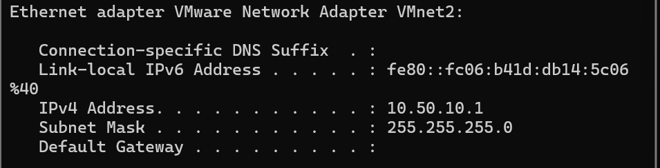
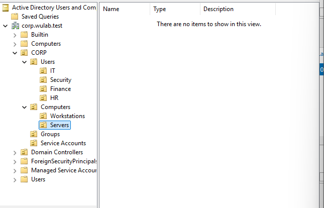
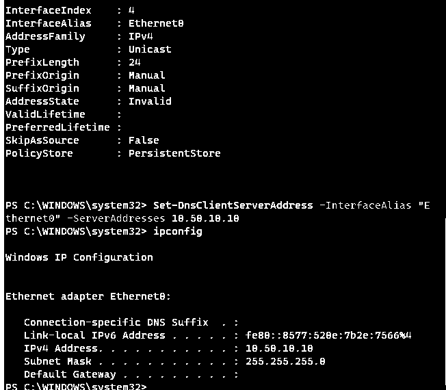
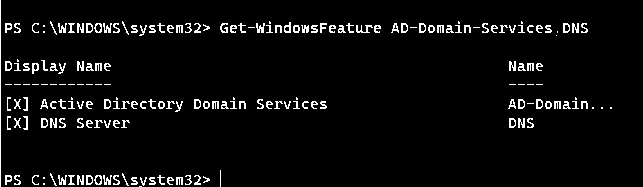
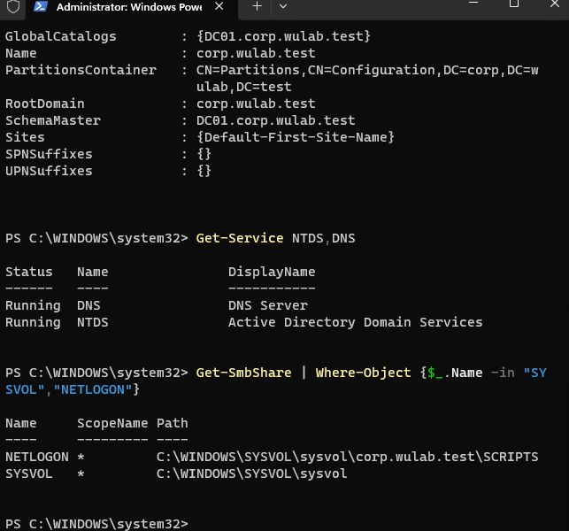
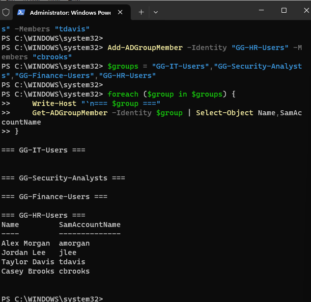

# Lab Architecture

## Status

**Domain Workstation Integrated — WS01 Placed in Workstations OU**

## Purpose

The Active Directory / Windows Enterprise Security Lab simulates a small enterprise Windows environment for practicing identity administration, authentication security, Group Policy, least privilege, Windows security monitoring, detection, investigation, and remediation.

The environment is intentionally small enough to operate as a home lab while maintaining realistic relationships between enterprise Windows systems.

---

## Active Directory Environment

### Forest / Domain

**DNS Domain:** `corp.wulab.test`

**NetBIOS Domain:** `WULAB`

The lab uses a single forest and a single Active Directory domain.

This design is appropriate for a small enterprise lab because it provides the core Active Directory identity and authentication experience without adding unnecessary multi-domain or multi-forest complexity.

---

## Systems

| Hostname | Operating System | Role | Planned IP Address |
|---|---|---|---|
| DC01 | Windows Server | Active Directory Domain Services, DNS, Group Policy, Authentication | 10.50.10.10 |
| WS01 | Windows 11 Pro | Domain Workstation / Security Testing Endpoint | 10.50.10.20 |
| SPLUNK01 | Existing Splunk Environment | Security Monitoring and Investigation | 10.50.10.30 |
| KALI01 | Kali Linux | Optional Controlled Security Testing | 10.50.10.40 |

---

## Virtual Network

**Platform:** VMware Workstation

**Virtual Network:** VMnet2

**Network Type:** Host-only

**Subnet:** `10.50.10.0/24`

**Subnet Mask:** `255.255.255.0`

**VMware Host Adapter:** `10.50.10.1`

**VMware DHCP:** Disabled

VMnet2 provides an isolated private network for the Active Directory security lab.

The host maintains connectivity to the lab through the VMware Network Adapter VMnet2 interface at `10.50.10.1`.

VMware DHCP is disabled so infrastructure systems can use predictable manually assigned IP addresses.

The Host-only design prevents the Active Directory lab network from being directly exposed to the physical LAN or Internet.

### Planned Addressing

| Device | IP Address | Status |
|---|---|---|
| VMware Host Adapter | 10.50.10.1 | Configured |
| DC01 | 10.50.10.10 | Reserved |
| WS01 | 10.50.10.20 | Configured |
| SPLUNK01 | 10.50.10.30 | Reserved |
| KALI01 | 10.50.10.40 | Reserved |

### Network Evidence


---

## DNS Design

DC01 will host DNS for the Active Directory domain.

Domain-joined workstations will use:

`10.50.10.10`

as their primary DNS server.

Active Directory relies heavily on DNS to locate Domain Controllers and domain services. Proper DNS configuration is therefore required for domain joining, authentication, Group Policy, and general Active Directory functionality.

---

## Virtual Machine Resources

### DC01

- 2 vCPU
- 4 GB RAM
- 70 GB thin-provisioned storage

### WS01

- 2 vCPU
- 6 GB RAM
- 80 GB thin-provisioned storage

### SPLUNK01

- 2–4 vCPU
- Approximately 6 GB RAM
- Existing Splunk environment

### KALI01

Optional.

- 2 vCPU
- 4 GB RAM
- 40 GB storage

KALI01 will normally remain powered off unless required for a controlled lab exercise.

---

## Organizational Unit Design

Configured OU structure:

```text
CORP
├── Users
│   ├── IT
│   ├── Security
│   ├── Finance
│   └── HR
├── Computers
│   ├── Workstations
│   └── Servers
├── Groups
└── Service Accounts
```

The organizational structure was created in Active Directory Users and Computers under the `CORP` OU. Department-specific user OUs separate IT, Security, Finance, and HR identities, while workstation and server computer objects are separated to support targeted Group Policy and administrative controls later in the lab.




---

## DC01 Deployment Evidence

DC01 has been deployed on the isolated VMnet2 network with the static address `10.50.10.10/24`. The address state was validated as `Preferred` before Active Directory role installation.



Active Directory Domain Services and DNS Server roles were installed successfully with the Windows Server management tools. DC01 was then promoted as the first Domain Controller for the new forest.




---

## Domain Controller Validation

DC01 was promoted as the first Domain Controller for `corp.wulab.test` with the NetBIOS domain `WULAB`.

Post-promotion validation confirmed:

- `DC01.corp.wulab.test` is registered as a Global Catalog.
- Active Directory Domain Services (`NTDS`) is running.
- DNS Server (`DNS`) is running.
- The `SYSVOL` share is published.
- The `NETLOGON` share is published.

These checks confirm that the new forest and Domain Controller are operational before organizational units, identities, groups, and client systems are added.




---

## Identity and Group Membership

Four departmental user accounts were created in their corresponding Organizational Units:

| Department | User | SamAccountName | Security Group |
|---|---|---|---|
| IT | Alex Morgan | `amorgan` | `GG-IT-Users` |
| Security | Jordan Lee | `jlee` | `GG-Security-Analysts` |
| Finance | Taylor Davis | `tdavis` | `GG-Finance-Users` |
| HR | Casey Brooks | `cbrooks` | `GG-HR-Users` |

Group membership was assigned using Active Directory PowerShell cmdlets and validated with `Get-ADGroupMember`.

This establishes the initial role-based access model that will later be used for Group Policy, workstation administration, server administration, authentication monitoring, and least-privilege testing.




---

## Security Group Design

The initial role-based security groups were created in the `CORP\Groups` OU as Global Security groups:

- `GG-IT-Users`
- `GG-Security-Analysts`
- `GG-Finance-Users`
- `GG-HR-Users`
- `GG-Workstation-Admins`
- `GG-Server-Admins`

These groups provide the foundation for role-based access control and least-privilege administration.


---

## WS01 Domain Integration

WS01 was configured with the static address `10.50.10.20/24`, uses DC01 at `10.50.10.10` for DNS, and was successfully joined to `corp.wulab.test`.

Domain authentication was validated with the `WULAB\\amorgan` account, and the WS01 computer object was moved from the default Computers container into `CORP > Computers > Workstations` so workstation-focused Group Policy can be scoped cleanly.


---

## Workstation Group Policy Baseline

A Group Policy Object named `GPO-Workstation-Security-Baseline` was created and linked to:

`CORP > Computers > Workstations`

This scope ensures that the security baseline applies specifically to domain workstations such as WS01 without affecting servers or the Domain Controller.

The GPO is currently being configured with workstation security controls.

### Configured Security Controls

- Account lockout threshold: **5 invalid logon attempts**
- Account lockout duration: **15 minutes**
- Reset account lockout counter after: **15 minutes**
- Limit local account use of blank passwords to console logon only: **Enabled**
- Interactive logon: Don't display last signed-in: **Enabled**
